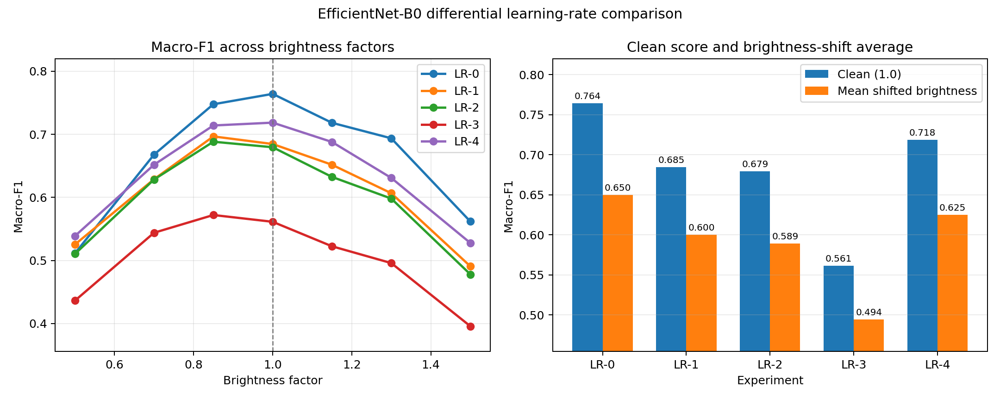

# EfficientNet 이해와 Learning Rate 비교 계획

## 1. EfficientNet이란?

EfficientNet은 이미지에서 특징을 찾아 클래스를 예측하는 CNN이다. 이름의 `Efficient`는 모델을 무작정 크게 만들지 않고, 비교적 적은 계산량으로 좋은 성능을 내도록 설계했다는 뜻이다.

일반적인 CNN은 앞쪽에서 선, 점, 색 변화 같은 단순한 특징을 찾고 뒤쪽으로 갈수록 모양, 경계, 질감처럼 복잡한 특징을 찾는다.

```text
피부 병변 이미지
→ 선·색·모서리
→ 병변의 경계·무늬·비대칭
→ 7개 클래스의 점수
→ 가장 높은 클래스를 최종 예측
```

## 2. EfficientNet의 핵심 아이디어

CNN의 성능을 높이는 대표적인 방법은 세 가지다.

- depth: 층을 더 깊게 만든다.
- width: 한 층에서 처리하는 특징 채널을 늘린다.
- resolution: 더 큰 이미지를 입력한다.

한 가지만 지나치게 키우면 계산량은 크게 증가하지만 성능 향상은 작을 수 있다. EfficientNet은 세 요소를 균형 있게 키우는 **compound scaling**을 사용한다.

```text
깊이 + 너비 + 이미지 해상도
        균형 있게 조절
```

## 3. MBConv 블록

EfficientNet의 주요 구성 요소는 MBConv(Mobile Inverted Bottleneck Convolution)다.

```text
입력 특징
→ 채널 확장
→ 채널별 convolution
→ 중요한 채널 강조
→ 채널 축소
→ 가능한 경우 원래 입력과 더하기
```

일반 convolution보다 계산을 효율적으로 수행하면서도 필요한 특징을 유지하려는 구조다. 입력과 출력을 더하는 연결은 학습 중 정보와 gradient가 전달되는 데 도움을 준다.

## 4. Depthwise separable convolution

일반 convolution은 공간 특징과 채널 조합을 한 번에 계산한다. EfficientNet의 MBConv는 이를 주로 두 단계로 나눈다.

1. depthwise convolution: 채널별로 공간 특징을 찾는다.
2. pointwise convolution: 1×1 convolution으로 채널 정보를 합친다.

계산을 나누기 때문에 일반 convolution보다 parameter와 연산량을 줄일 수 있다.

## 5. SE 블록

SE(Squeeze-and-Excitation) 블록은 모델이 만든 여러 채널 중 어떤 채널이 중요한지 학습한다.

피부 병변 이미지에서 모델이 다음 특징을 찾았다고 가정할 수 있다.

```text
피부 전체 색       → 중요도 조절
병변 경계          → 중요도 조절
병변 내부 무늬     → 중요도 조절
주변 배경          → 중요도 조절
```

SE 블록은 예측에 유용한 채널의 영향력을 높이고 덜 유용한 채널의 영향력을 낮춘다. 이를 채널 단위 attention으로 이해할 수 있다.

## 6. EfficientNet-B0의 의미

EfficientNet은 B0부터 B7까지 여러 크기가 있다.

```text
B0: 가장 작고 빠른 기본 모델
B1~B3: 중간 크기
B4~B7: 크고 느리지만 표현 능력이 더 큰 모델
```

숫자가 커질수록 보통 모델 크기, 연산량, GPU 메모리 사용량과 학습 시간이 증가한다. 이 프로젝트에서는 RTX 4070에서 충분히 학습할 수 있고 구조도 비교적 간단한 B0를 선택했다.

## 7. 이 프로젝트의 EfficientNet-B0

전체 예측 과정은 다음과 같다.

```text
RGB 피부 병변 이미지
→ 320×320 입력
→ EfficientNet-B0 feature blocks
→ Global Average Pooling
→ Dropout 0.3
→ 7-class Linear classifier
→ MEL / NV / BCC / AKIEC / BKL / DF / VASC
```

ImageNet으로 사전학습된 가중치를 사용한다. 앞쪽 특징 추출 부분은 고정하고 마지막 4개 feature block과 새 7-class 분류기를 학습한다. 나이, 성별, 병변 위치 같은 metadata는 입력하지 않는다.

현재 주요 설정은 다음과 같다.

- 입력 크기: 320×320
- batch size: 32
- optimizer: AdamW
- learning rate: 전체 `0.0002`
- weight decay: `0.0001`
- scheduler: cosine annealing
- loss: class-weighted cross entropy
- label smoothing: `0.05`
- epochs: 20
- 학습 가능한 parameter: 3,707,855개
- 최고 checkpoint: epoch 17
- dev Macro-F1: **0.7641**
- dev balanced accuracy: **0.7958**

## 8. EfficientNet의 현재 한계

정상 밝기에서는 가장 높은 점수를 기록했지만 매우 어두운 영상에서는 성능이 떨어졌다.

```text
밝기 1.0 Macro-F1: 0.7641
밝기 0.5 Macro-F1: 0.5113
```

또한 현재 실험은 seed 42의 한 dev split에서 얻은 결과다. 여러 설정을 같은 dev set에서 계속 선택하면 dev에 과적합될 수 있으므로 최종 후보는 반복 seed 또는 별도 test split으로 다시 확인해야 한다.

## 9. 분류기와 본체의 Learning Rate를 나누는 이유

현재는 새로 만든 분류기와 ImageNet 사전학습 EfficientNet 본체가 모두 `0.0002`를 사용한다.

```text
현재
분류기 learning rate: 0.0002
EfficientNet 본체:    0.0002
```

하지만 두 부분의 출발 상태는 다르다.

- 분류기는 새로 만들어져 아직 아무것도 배우지 못한 상태다.
- EfficientNet 본체는 ImageNet에서 유용한 이미지 특징을 이미 배운 상태다.

따라서 분류기는 큰 learning rate로 빠르게 학습하고, 본체는 작은 learning rate로 기존 특징을 조금씩 수정하는 방법이 합리적이다.

```text
제안
분류기 learning rate: 0.0005
EfficientNet 본체:    0.00005
```

본체까지 큰 learning rate로 학습하면 사전학습 특징이 빠르게 훼손될 수 있다. 반대로 본체 learning rate가 너무 작으면 피부 병변에 맞게 충분히 바뀌지 않을 수 있다.

## 10. 5개 Learning Rate 비교 실험

데이터 split, seed, 20 epochs, augmentation, batch size, loss와 마지막 4개 block fine-tuning을 모두 고정하고 본체와 분류기의 learning rate만 바꿨다. LR-0은 이미 같은 조건으로 학습한 기존 checkpoint를 재사용했고 LR-1~LR-4는 RTX 4070에서 새로 학습했다.

| 실험 | EfficientNet 본체 LR | 분류기 LR | 확인 목적 |
|---|---:|---:|---|
| LR-0 | 0.00020 | 0.00020 | 기존 baseline |
| LR-1 | 0.00005 | 0.00020 | 본체 LR만 낮춘 효과 |
| LR-2 | 0.00005 | 0.00050 | 10:1 분리 LR |
| LR-3 | 0.00001 | 0.00050 | 본체를 매우 천천히 조정 |
| LR-4 | 0.00010 | 0.00050 | 본체를 비교적 빠르게 조정 |

## 11. 실제 결과

| 실험 | 최고 epoch | Train F1 | Dev Macro-F1 | Balanced accuracy | 변형 밝기 평균 | 최악 밝기 F1 |
|---|---:|---:|---:|---:|---:|---:|
| **LR-0** | 17 | 0.9165 | **0.7641** | 0.7958 | **0.6501** | 0.5113 |
| LR-1 | 16 | 0.7782 | 0.6846 | 0.8041 | 0.6000 | 0.4907 |
| LR-2 | 16 | 0.7806 | 0.6795 | **0.8122** | 0.5893 | 0.4780 |
| LR-3 | 17 | 0.5926 | 0.5613 | 0.7714 | 0.4944 | 0.3957 |
| LR-4 | 17 | 0.8513 | 0.7185 | 0.8078 | 0.6252 | **0.5277** |



정상 밝기 Macro-F1을 주 지표로 사용했으므로 **LR-0의 본체 0.0002 / 분류기 0.0002를 최종 설정으로 유지**한다. 처음 예상했던 LR-2는 0.6795로 기준보다 0.0846 낮았다.

## 12. 결과 해석

### 본체 LR을 너무 낮추면 underfitting이 발생했다

LR-3은 train F1도 0.5926에 머물렀다. 이는 과적합보다 20 epochs 안에 피부 병변 특징을 충분히 배우지 못한 underfitting에 가깝다. ImageNet 특징을 보존하는 것도 중요하지만, 이 데이터에서는 마지막 4개 block을 충분한 속도로 바꾸는 것이 더 중요했다.

### 분류기 LR을 높인다고 정상 점수가 올라가지는 않았다

LR-1과 LR-2는 본체 LR이 0.00005로 같다. 분류기 LR을 0.0002에서 0.0005로 올리자 dev Macro-F1이 0.6846에서 0.6795로 오히려 조금 낮아졌다. 새 분류기를 빠르게 학습한다는 아이디어가 항상 더 좋은 일반화를 보장하지는 않는다.

### LR-4는 강건성과 정상 점수의 중간 지점이었다

LR-4는 새 분리 LR 중 가장 높은 0.7185를 기록했다. 최악 밝기 점수 0.5277과 상대 하락률 26.56%는 LR-0의 0.5113과 33.08%보다 좋았다. 그러나 프로젝트 목표가 정상 Macro-F1 최대화이므로 0.0456 더 높은 LR-0을 선택한다.

### Balanced accuracy만으로 모델을 고르지 않은 이유

LR-2의 balanced accuracy는 0.8122로 가장 높았지만 Macro-F1은 0.6795였다. Balanced accuracy는 클래스별 recall만 평균하고, Macro-F1은 precision과 recall을 함께 반영한다. 이 프로젝트의 사전 결정된 주 지표가 Macro-F1이므로 LR-0이 최종 모델이다.

## 13. 구현 방법

`training.py`에서 optimizer parameter group을 사용해 학습 가능한 encoder parameter와 classifier parameter를 나눴다.

```python
optimizer = AdamW([
    {"params": backbone_parameters, "lr": backbone_lr},
    {"params": classifier_parameters, "lr": classifier_lr},
])
```

각 YAML은 다음 두 값을 독립적으로 지정한다.

```yaml
training:
  backbone_learning_rate: 0.0002
  classifier_learning_rate: 0.0002
```

cosine scheduler는 두 parameter group의 시작 비율을 유지하면서 각각의 learning rate를 감소시킨다. 실행 스크립트는 완료된 checkpoint와 밝기 평가가 있으면 재사용하므로 중단 후 다시 실행해도 끝난 실험을 반복하지 않는다.

```powershell
powershell -ExecutionPolicy Bypass -File scripts\run_efficientnet_lr_experiments.ps1
```

정확한 결과 CSV는 `docs/results/efficientnet_lr_comparison.csv`에 저장했다.

## 14. 다음 실험

Learning rate는 기존 `0.0002 / 0.0002`를 유지한다. 다음에는 여러 요소를 동시에 바꾸지 않고 아래 순서로 하나씩 비교하는 것이 좋다.

1. 약한 밝기 증강 `0.15`, 적용 확률 `0.30`
2. 20 epochs와 25~30 epochs + early stopping 비교
3. 최종 후보를 seed 42, 43, 44로 반복해 평균과 표준편차 확인

## 15. 발표용 요약

> EfficientNet은 모델의 깊이, 너비, 이미지 해상도를 균형 있게 설계해 계산량 대비 높은 성능을 목표로 하는 CNN입니다. 이 프로젝트에서는 ImageNet으로 사전학습된 EfficientNet-B0의 마지막 4개 block과 7-class 분류기를 피부 병변 데이터에 맞게 학습했습니다. 본체와 분류기의 learning rate 다섯 조합을 동일 조건에서 비교한 결과, 둘 다 0.0002를 사용한 기존 설정이 Macro-F1 0.7641로 가장 높았습니다. 본체 learning rate가 너무 작으면 피부 병변에 충분히 적응하지 못해 underfitting이 발생했고, 분류기 learning rate를 크게 하는 것도 성능 향상으로 이어지지 않았습니다.
